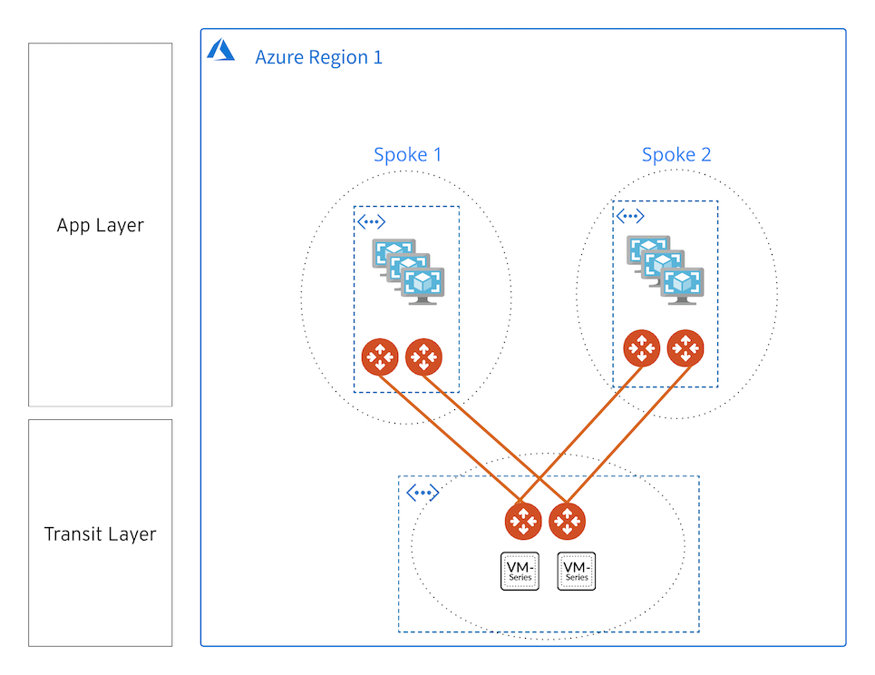

# Preakness with Test Kit

### Summary

This standard POC builds Aviatrix Transit with FireNet in Azure. Refer to the bill of materials below for additional detail.
The test VMs will use ```~/.ssh/id_rsa.pub``` for ssh authentication, have port 22 open and be provided public IPs.
In order to get the public IPs for the VMs you'll need to go to the Azure Console 


### BOM

- 1 Aviatrix Transit FireNet in Azure with 2 spokes
- 1 Custom Resource group with 2 Ubuntu 18.04 VMs with iperf3 and ntttcp installed **(1 per spoke)**
- Firewalls are provisioned but detached


### Infrastructure diagram



### Software Version Requirements

Component | Version
--- | ---
Aviatrix Controller | (6.2) UserConnect-6.2.1837 (Nov 10 Patch)
Aviatrix Terraform Provider | 2.17
Terraform | 0.12
Azure Terraform Provider | 2.30

### Modules

Module Name | Version | Description
:--- | :--- | :---
[terraform-aviatrix-modules/azure-transit-firenet/aviatrix](https://registry.terraform.io/modules/terraform-aviatrix-modules/azure-transit-firenet/aviatrix/1.0.2) | 1.1.1 | This module deploys a VNET, Aviatrix transit gateways and firewall instances.
[terraform-aviatrix-modules/azure-spoke/aviatrix](https://registry.terraform.io/modules/terraform-aviatrix-modules/azure-spoke/aviatrix/1.0.1) | 1.1.1 | This module deploys a VNET and an Aviatrix spoke gateway in Azure and attaches it to an Aviatrix Transit Gateway
[terraform-aviatrix-modules/mc-transit-peering/aviatrix](https://registry.terraform.io/modules/terraform-aviatrix-modules/mc-transit-peering/aviatrix/1.0.0) | 1.0.0 | Creates a full mesh transit peering from a list of transit gateway names
[Azure/compute/azurerm](https://registry.terraform.io/modules/Azure/compute/azurerm/0.9.0) | 0.9.0 | Azure Terraform module to deploy virtual machines

### Variables

The variables are defined in ```terraform.tfvars```.

**Note:** ```ha_enabled = false``` controls whether ha is built for spokes. 

```instance_size``` controls the size of all the transit spokes and gateways. It has been increased to use ```Standard_F16s_v2```

```test_instance_size``` controls the size of the test vm it is also set at ```Standard_F16s_v2```

### Prerequisites

- Software version requirements met
- Aviatrix Controller with Access Accounts defined for AWS and Azure
- Sufficient limits in place for Azure region in scope **_(EIPs, Compute quotas, etc.)_**
- Active subscriptions for the NGFW firewall images in scope
- terraform .12 in the user environment ```terraform -v```
- [Install the the azure cli](https://docs.microsoft.com/en-us/cli/azure/install-azure-cli-macos) on the workstation and authenticate with ```az login```

### Workflow

- Modify ```terraform.tfvars``` _(i.e. access account name, regions, cidrs, etc.)_ and save the file.
- ```terraform init```
- ```terraform plan```
- ```terraform apply --auto-approve```

### Test command examples

You can ssh into the the test vm's created in azure like so...

```ssh azureuser@TESTVM1PUBLICIP```

```ssh azureuser@TESTVM1PUBLICIP```


#### iperf

Replace with the private IP of one of the created test vms - check Azure console for the value.
Run the client on one test vm and the server on another test vm.

```
iperf3 -c 10.21.3.20 -i 2 -t 30 -M 1400 -P 1 -p 5201
iperf3 -s -p 5201
```

#### ntttcp

```
ntttcp -r
ntttcp -s10.21.3.20
```

### Backend Configuration (Optional)

For long-running infrastructure provisioning some users find it beneficial to take advantage of remote execution and state management in Terraform Cloud.

- Modify ```backend.tf.template``` to reflect your Terraform organization and workspace

A significant amount of infrastructure will be provisioned. 

- Observe progress in Aviatrix Controller
- Observe progress in terminal
- Observe progress in Terraform Cloud (Optional)

### Terraform state after provisioning


```
$ terraform state list
data.template_file.azure-init
azurerm_resource_group.example
module.azure_spoke1.aviatrix_spoke_gateway.default
module.azure_spoke1.aviatrix_vpc.default
module.azure_spoke2.aviatrix_spoke_gateway.default
module.azure_spoke2.aviatrix_vpc.default
module.azure_test_vm1.data.azurerm_resource_group.vm
module.azure_test_vm1.azurerm_availability_set.vm
module.azure_test_vm1.azurerm_network_interface.vm[0]
module.azure_test_vm1.azurerm_network_interface_security_group_association.test[0]
module.azure_test_vm1.azurerm_network_security_group.vm
module.azure_test_vm1.azurerm_network_security_rule.vm[0]
module.azure_test_vm1.azurerm_public_ip.vm[0]
module.azure_test_vm1.azurerm_virtual_machine.vm-linux[0]
module.azure_test_vm1.random_id.vm-sa
module.azure_test_vm2.data.azurerm_resource_group.vm
module.azure_test_vm2.azurerm_availability_set.vm
module.azure_test_vm2.azurerm_network_interface.vm[0]
module.azure_test_vm2.azurerm_network_interface_security_group_association.test[0]
module.azure_test_vm2.azurerm_network_security_group.vm
module.azure_test_vm2.azurerm_network_security_rule.vm[0]
module.azure_test_vm2.azurerm_public_ip.vm[0]
module.azure_test_vm2.azurerm_virtual_machine.vm-linux[0]
module.azure_test_vm2.random_id.vm-sa
module.azure_transit_1.aviatrix_firenet.firenet_ha[0]
module.azure_transit_1.aviatrix_firewall_instance.firewall_instance_1[0]
module.azure_transit_1.aviatrix_firewall_instance.firewall_instance_2[0]
module.azure_transit_1.aviatrix_transit_gateway.default
module.azure_transit_1.aviatrix_vpc.default
```

